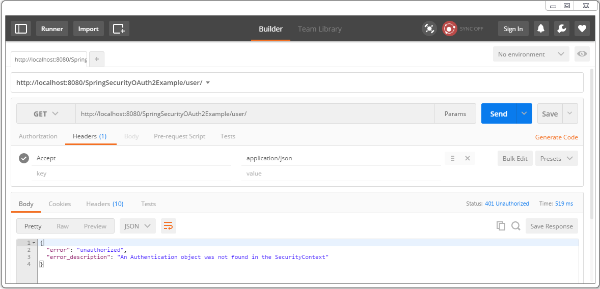
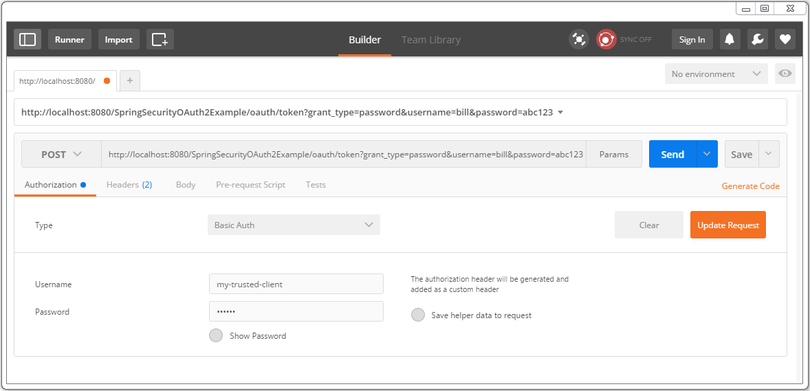
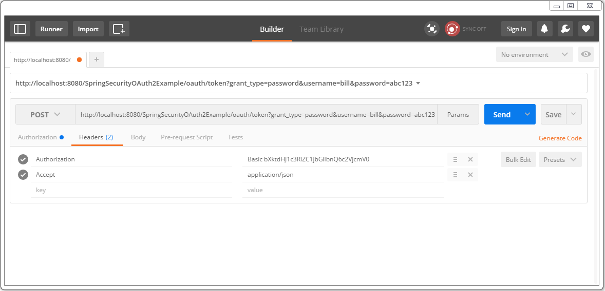
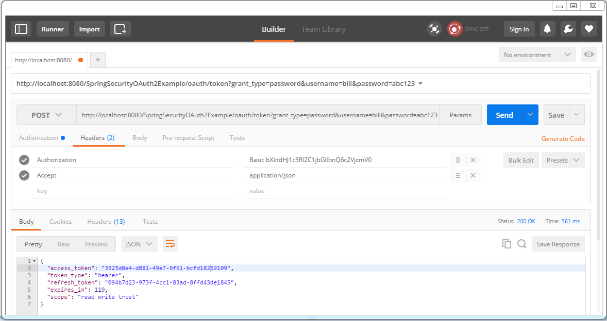
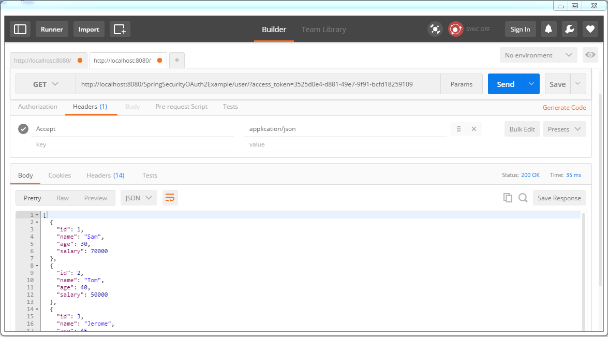
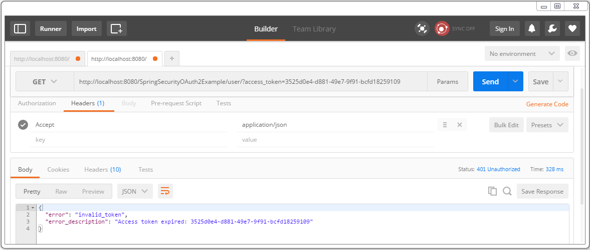
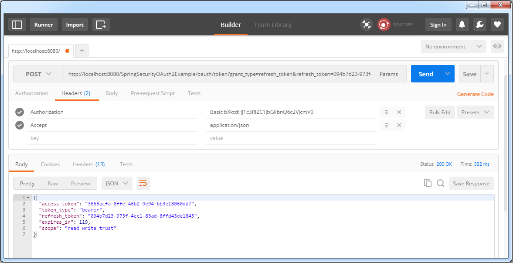
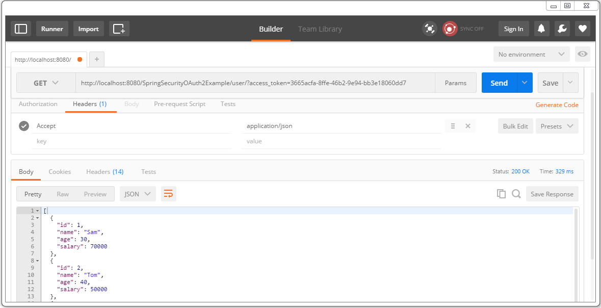
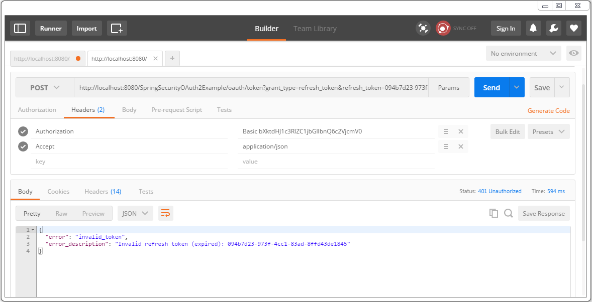
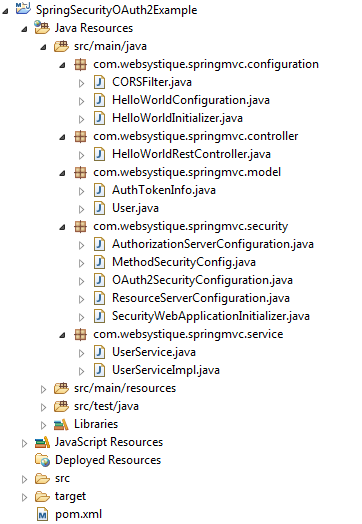

【DarrenLuo翻译中】
# 使用 OAuth2 保护 Spring REST API

原文：[Secure Spring REST API using OAuth2](http://websystique.com/spring-security/secure-spring-rest-api-using-oauth2/)

译者：DarrenLuo

校对：

现在让我们使用 `OAuth2` 保护我们的 `Spring REST API`，这个简单指南展示了使用 `Spring OAuth2` 保护 REST API 需要什么。我们的用力非常符合 OAuth2 的 `Resource-owner Password Grant` 规范流程。我们将使用两种不同的客户端 [ Postman 和 一个基于 `Spring RestTemplate` 的 Java 应用 ] 来访问我们受 OAuth2 保护的 REST 资源。

如果你已经熟悉 OAuth2 的概念，你可能希望跳过理论立即进入代码。和往常一样，完整的代码可以在本文末尾的附件中找到。让我们开始吧。

## 什么是 OAuth2

OAuth2 是一个标准化的授权协议/框架。参照官方的 [OAuth2 规范](https://tools.ietf.org/html/rfc6749):

> OAuth 2.0 授权框架允许第三方应用程序通过编排资源以资源拥有者的名义批准拥有者和 HTTP 服务之间的交互或第三方应用以其自己的名义获取权力取得一个 HTTP 服务的*有限访问*。

像 Google、Facebook 和其他的大牌玩家已经在使用他们自己的 OAuth2 实现有一段时间了。企业也正在快速采用 OAuth2。

我发现 OAuth2 规范遵守起来非常简单。然而，如果你想快速开始，可以在[这里](http://www.bubblecode.net/en/2016/01/22/understanding-oauth2/)找到一篇关于 OAuth2 基础的优秀文章，可以让你深入洞察 OAuth2 的理论概念。

[Spring Security OAuth](http://projects.spring.io/spring-security-oauth/)项目提供了我们可能需要的所有必要 API，以便于使用 Spring 开发符合 OAuth2 的实现。官方的[Spring security oauth](https://github.com/spring-projects/spring-security-oauth/tree/master/samples/oauth2)项目提供了实现 OAuth2 的详细示例。本文的代码示例受这些示例本身的启发。本文的目的是为了保护我们的 REST API 只使用需要的最低限度，仅此而已。

你至少应该了解 OAuth2 中的四个关键概念：

### 1. OAuth2 角色

OAuth2 定义了四种角色:

- `资源拥有者（resource owner）：`

  应该是你。一个能够授权访问受保护资源的实体。当资源拥有者是一个人时，它被称为最终用户。

- `资源服务器（resource server）：`

  承载受保护资源的服务器，能使用访问令牌接收和响应受保护资源请求。

- `客户端（client）：`

  一个代表资源所有者及其授权进行受保护资源请求的应用。它可能是一个要求你允许访问你的 Facebook 订阅的移动应用，一个尝试访问 REST API 的 REST 客户端，一个提供使用 Facebook 账户代替登陆选项的网站[例如 Stackoverflow]。

- `授权服务器（authorization server）：`

  这个服务器在成功验证资源所有者并获得授权后向客户端发放访问令牌。

在我们的例子中，我们的 REST API 只能通过资源服务器访问，资源服务器将需要访问令牌和请求在一起。

### 2. OAuth2 授权许可类型

授权许可是资源所有者授权（访问其受保护的资源）的凭证，该许可用于客户端获取访问令牌。规范中定义了四种授权类型：

- `授权码模式（authorization code）`
- `简化模式（implicit）`
- `资源所有者密码凭证（resource owner password credentials）`
- `客户端凭证（client credentials）`

我们将使用`资源所有者密码凭证`授权类型。原因很简单，我们没有实现将我们重定向到登陆页面的视图。只有客户端[Postman 或基于 RestTemplate 的 Java 客户端等]拥有资源所有者的凭证，并且他们将这些凭证[连同客户端凭证]提供给认证服务器以最终接收访问令牌[和可选的刷新令牌]，然后使用该令牌真实的访问资源。

一个常见的例子是你智能手机上的 `GMail app` [客户端]，它会获取你的凭证并使用他们连接到 `GMail servers` 。它还表明，当客户端和服务器都来自同一家公司并互相信任时，“密码凭证授权”是最合适的，你不希望将凭证提供给第三方。

### 3. OAuth2 令牌

令牌是符合规范的随机字符串，由认证服务器生成并在客户端请求时发布。

- `访问令牌（Access Token）`：和每个请求一起发送，通常在很短的时间内有效[例如一小时]。
- `刷新令牌（Refresh Token）` : 主要用于获得一个新的访问令牌，不随每个请求发送，通常比访问令牌的寿命更长。

**关于 HTTPS 的一句话**：对于任何类型的安全实现，从基本认证到完整的 OAuth2 实现，`HTTPS` 都是必须的。没有 HTTPS，不管你实现什么，安全性都容易受到攻击。

### 4. OAuth2 访问令牌范围

客户端能要求特定访问权限使用范围的资源[想要访问该用户 facebook 账户的订阅和照片]，认证服务器相应的返回范围，该范围显示实际授予客户端的访问权限[例如资源所有者只允许订阅访问，没有照片]。

------

## 让我们进入代码

为了访问我们的 REST 资源，让我们用 Spring Security 来实现必要的构建模块以实现 OAuth。

### 1. 资源服务器

资源服务器承载客户端感兴趣的资源[我们的 REST API]。资源位于 `/user/`。OAuth2 资源服务器使用`@EnableResourceServer` 注解以开启 Spring Security 过滤器使用传入的 OAuth2 令牌对请求进行身份认证。类 `ResourceServerConfigureAdapter` 实现了 `ResourceServerConfigurer` 提供方法来调整受 OAuth2 安全保护的访问规则和路径。

```java
package com.websystique.springmvc.security;

import org.springframework.context.annotation.Configuration;
import org.springframework.security.config.annotation.web.builders.HttpSecurity;
import org.springframework.security.oauth2.config.annotation.web.configuration.EnableResourceServer;
import org.springframework.security.oauth2.config.annotation.web.configuration.ResourceServerConfigurerAdapter;
import org.springframework.security.oauth2.config.annotation.web.configurers.ResourceServerSecurityConfigurer;
import org.springframework.security.oauth2.provider.error.OAuth2AccessDeniedHandler;

@Configuration
@EnableResourceServer
public class ResourceServerConfiguration extends ResourceServerConfigurerAdapter {

    private static final String RESOURCE_ID = "my_rest_api";

    @Override
    public void configure(ResourceServerSecurityConfigurer resources) {
        resources.resourceId(RESOURCE_ID).stateless(false);
    }

    @Override
    public void configure(HttpSecurity http) throws Exception {
        http
        .anonymous().disable()
        .requestMatchers().antMatchers("/user/**")
        .and().authorizeRequests()
        .antMatchers("/user/**").access("hasRole('ADMIN')")
        .and().exceptionHandling().accessDeniedHandler(new OAuth2AccessDeniedHandler());
    }
}
```

### 2. 授权服务器

授权服务器负责验证凭证，如果凭证正常，则提供令牌[刷新令牌和访问令牌]。它还包含关于注册客户端和可能访问的访问以及授权类型的信息。token store 用于存储令牌，我们将使用内存令牌存储。`@EnableAuthorizationServer` 在当前应用上下文中启用一个认证服务器（即一个认证端点（AuthorizationEndpoint）和一个令牌端点（TokenEndpoint））。类  `AuthorizationServerConfigurerAdapter` 实现了 `AuthorizationServerConfigurer`提供了所有配置一个认证服务器的所有必要方法。

```java
package com.websystique.springmvc.security;

import org.springframework.beans.factory.annotation.Autowired;
import org.springframework.beans.factory.annotation.Qualifier;
import org.springframework.context.annotation.Configuration;
import org.springframework.security.authentication.AuthenticationManager;
import org.springframework.security.oauth2.config.annotation.configurers.ClientDetailsServiceConfigurer;
import org.springframework.security.oauth2.config.annotation.web.configuration.AuthorizationServerConfigurerAdapter;
import org.springframework.security.oauth2.config.annotation.web.configuration.EnableAuthorizationServer;
import org.springframework.security.oauth2.config.annotation.web.configurers.AuthorizationServerEndpointsConfigurer;
import org.springframework.security.oauth2.config.annotation.web.configurers.AuthorizationServerSecurityConfigurer;
import org.springframework.security.oauth2.provider.approval.UserApprovalHandler;
import org.springframework.security.oauth2.provider.token.TokenStore;

@Configuration
@EnableAuthorizationServer
public class AuthorizationServerConfiguration extends AuthorizationServerConfigurerAdapter {

    private static String REALM="MY_OAUTH_REALM";

    @Autowired
    private TokenStore tokenStore;

    @Autowired
    private UserApprovalHandler userApprovalHandler;

    @Autowired
    @Qualifier("authenticationManagerBean")
    private AuthenticationManager authenticationManager;

    @Override
    public void configure(ClientDetailsServiceConfigurer clients) throws Exception {

        clients.inMemory()
            .withClient("my-trusted-client")
            .authorizedGrantTypes("password", "authorization_code", "refresh_token", "implicit")
            .authorities("ROLE_CLIENT", "ROLE_TRUSTED_CLIENT")
            .scopes("read", "write", "trust")
            .secret("secret")
            .accessTokenValiditySeconds(120).//Access token is only valid for 2 minutes.
            refreshTokenValiditySeconds(600);//Refresh token is only valid for 10 minutes.
    }

    @Override
    public void configure(AuthorizationServerEndpointsConfigurer endpoints) throws Exception {
        endpoints.tokenStore(tokenStore).userApprovalHandler(userApprovalHandler)
                .authenticationManager(authenticationManager);
    }

    @Override
    public void configure(AuthorizationServerSecurityConfigurer oauthServer) throws Exception {
        oauthServer.realm(REALM+"/client");
    }
}
```

以上配置

- 注册了一个客户端ID为‘my-trusted-client’，密码为‘secret’，允许的角色和范围的客户端。
- Specifies that any generated access token will be valid for only 120 seconds
- Specifies that any generated refresh token will be valid for only 600 seconds

### 3. 安全配置

把所有东西粘在一起。`/oauth/token`端点被用于请求令牌[访问或刷新]。在这里配置资源拥有者[bill,bob]。

```java
package com.websystique.springmvc.security;

import org.springframework.beans.factory.annotation.Autowired;
import org.springframework.context.annotation.Bean;
import org.springframework.context.annotation.Configuration;
import org.springframework.security.authentication.AuthenticationManager;
import org.springframework.security.config.annotation.authentication.builders.AuthenticationManagerBuilder;
import org.springframework.security.config.annotation.web.builders.HttpSecurity;
import org.springframework.security.config.annotation.web.configuration.EnableWebSecurity;
import org.springframework.security.config.annotation.web.configuration.WebSecurityConfigurerAdapter;
import org.springframework.security.oauth2.provider.ClientDetailsService;
import org.springframework.security.oauth2.provider.approval.ApprovalStore;
import org.springframework.security.oauth2.provider.approval.TokenApprovalStore;
import org.springframework.security.oauth2.provider.approval.TokenStoreUserApprovalHandler;
import org.springframework.security.oauth2.provider.request.DefaultOAuth2RequestFactory;
import org.springframework.security.oauth2.provider.token.TokenStore;
import org.springframework.security.oauth2.provider.token.store.InMemoryTokenStore;

@Configuration
@EnableWebSecurity
public class OAuth2SecurityConfiguration extends WebSecurityConfigurerAdapter {

    @Autowired
    private ClientDetailsService clientDetailsService;

    @Autowired
    public void globalUserDetails(AuthenticationManagerBuilder auth) throws Exception {
        auth.inMemoryAuthentication()
        .withUser("bill").password("abc123").roles("ADMIN").and()
        .withUser("bob").password("abc123").roles("USER");
    }

    @Override
    protected void configure(HttpSecurity http) throws Exception {
        http
        .csrf().disable()
        .anonymous().disable()
        .authorizeRequests()
        .antMatchers("/oauth/token").permitAll();
    }

    @Override
    @Bean
    public AuthenticationManager authenticationManagerBean() throws Exception {
        return super.authenticationManagerBean();
    }


    @Bean
    public TokenStore tokenStore() {
        return new InMemoryTokenStore();
    }

    @Bean
    @Autowired
    public TokenStoreUserApprovalHandler userApprovalHandler(TokenStore tokenStore){
        TokenStoreUserApprovalHandler handler = new TokenStoreUserApprovalHandler();
        handler.setTokenStore(tokenStore);
        handler.setRequestFactory(new DefaultOAuth2RequestFactory(clientDetailsService));
        handler.setClientDetailsService(clientDetailsService);
        return handler;
    }

    @Bean
    @Autowired
    public ApprovalStore approvalStore(TokenStore tokenStore) throws Exception {
        TokenApprovalStore store = new TokenApprovalStore();
        store.setTokenStore(tokenStore);
        return store;
    }
}
```

另外，如果我们希望使用全局方法安全可以激活`@PreFilter`、`@PostFilter`、`PreAuthorize`、`PostAuthorize`注解。

```java
package com.websystique.springmvc.security;

import org.springframework.beans.factory.annotation.Autowired;
import org.springframework.context.annotation.Configuration;
import org.springframework.security.access.expression.method.MethodSecurityExpressionHandler;
import org.springframework.security.config.annotation.method.configuration.EnableGlobalMethodSecurity;
import org.springframework.security.config.annotation.method.configuration.GlobalMethodSecurityConfiguration;
import org.springframework.security.oauth2.provider.expression.OAuth2MethodSecurityExpressionHandler;

@Configuration
@EnableGlobalMethodSecurity(prePostEnabled = true, proxyTargetClass = true)
public class MethodSecurityConfig extends GlobalMethodSecurityConfiguration {
    @Autowired
    private OAuth2SecurityConfiguration securityConfig;

    @Override
    protected MethodSecurityExpressionHandler createExpressionHandler() {
        return new OAuth2MethodSecurityExpressionHandler();
    }
}
```

### 4. 端点及其目的

- 尝试在没有任何授权的情况下访问资源[REST API][当然会失败]。

    `GET http://localhost:8080/SpringSecurityOAuth2Example/user/`

- 在 `/oauth/token` 上使用 **HTTP POST** 请求令牌[access+fresh]，带上 `grant_type=password` 和资源所有者凭证作为请求参数。此外，在认证 header 中发送客户端凭证。

    `POST http://localhost:8080/SpringSecurityOAuth2Example/oauth/token?grant_type=password&username=bill&password=abc123`

- 通过有效的刷新令牌请求一个新的访问令牌，在 `/oauth/token` 上使用 **HTTP POST**，带上 `grant_type=refresh`，并发送真实的刷新令牌。此外，在认证 header 中发送客户端凭证。

    `POST http://localhost:8080/SpringSecurityOAuth2Example/oauth/token?grant_type=refresh_token&refresh_token=094b7d23-973f-4cc1-83ad-8ffd43de1845`

- 通过在请求中使用 `access_token` 查询参数提供一个访问令牌访问资源。

    `GET http://localhost:8080/SpringSecurityOAuth2Example/user/?access_token=3525d0e4-d881-49e7-9f91-bcfd18259109`

### 5. Rest API

我在大多数帖子中使用的简单 Spring REST API。

```java
package com.websystique.springmvc.controller;

import java.util.List;

import org.springframework.beans.factory.annotation.Autowired;
import org.springframework.http.HttpHeaders;
import org.springframework.http.HttpStatus;
import org.springframework.http.MediaType;
import org.springframework.http.ResponseEntity;
import org.springframework.web.bind.annotation.PathVariable;
import org.springframework.web.bind.annotation.RequestBody;
import org.springframework.web.bind.annotation.RequestMapping;
import org.springframework.web.bind.annotation.RequestMethod;
import org.springframework.web.bind.annotation.RestController;
import org.springframework.web.util.UriComponentsBuilder;

import com.websystique.springmvc.model.User;
import com.websystique.springmvc.service.UserService;

@RestController
public class HelloWorldRestController {

    @Autowired
    UserService userService;  //Service which will do all data retrieval/manipulation work


    //-------------------Retrieve All Users--------------------------------------------------------

    @RequestMapping(value = "/user/", method = RequestMethod.GET)
    public ResponseEntity<List<User>> listAllUsers() {
        List<User> users = userService.findAllUsers();
        if(users.isEmpty()){
            return new ResponseEntity<List<User>>(HttpStatus.NO_CONTENT);//You many decide to return HttpStatus.NOT_FOUND
        }
        return new ResponseEntity<List<User>>(users, HttpStatus.OK);
    }


    //-------------------Retrieve Single User--------------------------------------------------------

    @RequestMapping(value = "/user/{id}", method = RequestMethod.GET, produces = {MediaType.APPLICATION_JSON_VALUE,MediaType.APPLICATION_XML_VALUE})
    public ResponseEntity<User> getUser(@PathVariable("id") long id) {
        System.out.println("Fetching User with id " + id);
        User user = userService.findById(id);
        if (user == null) {
            System.out.println("User with id " + id + " not found");
            return new ResponseEntity<User>(HttpStatus.NOT_FOUND);
        }
        return new ResponseEntity<User>(user, HttpStatus.OK);
    }


    //-------------------Create a User--------------------------------------------------------

    @RequestMapping(value = "/user/", method = RequestMethod.POST)
    public ResponseEntity<Void> createUser(@RequestBody User user, UriComponentsBuilder ucBuilder) {
        System.out.println("Creating User " + user.getName());

        if (userService.isUserExist(user)) {
            System.out.println("A User with name " + user.getName() + " already exist");
            return new ResponseEntity<Void>(HttpStatus.CONFLICT);
        }

        userService.saveUser(user);

        HttpHeaders headers = new HttpHeaders();
        headers.setLocation(ucBuilder.path("/user/{id}").buildAndExpand(user.getId()).toUri());
        return new ResponseEntity<Void>(headers, HttpStatus.CREATED);
    }


    //------------------- Update a User --------------------------------------------------------

    @RequestMapping(value = "/user/{id}", method = RequestMethod.PUT)
    public ResponseEntity<User> updateUser(@PathVariable("id") long id, @RequestBody User user) {
        System.out.println("Updating User " + id);

        User currentUser = userService.findById(id);

        if (currentUser==null) {
            System.out.println("User with id " + id + " not found");
            return new ResponseEntity<User>(HttpStatus.NOT_FOUND);
        }

        currentUser.setName(user.getName());
        currentUser.setAge(user.getAge());
        currentUser.setSalary(user.getSalary());

        userService.updateUser(currentUser);
        return new ResponseEntity<User>(currentUser, HttpStatus.OK);
    }

    //------------------- Delete a User --------------------------------------------------------

    @RequestMapping(value = "/user/{id}", method = RequestMethod.DELETE)
    public ResponseEntity<User> deleteUser(@PathVariable("id") long id) {
        System.out.println("Fetching & Deleting User with id " + id);

        User user = userService.findById(id);
        if (user == null) {
            System.out.println("Unable to delete. User with id " + id + " not found");
            return new ResponseEntity<User>(HttpStatus.NOT_FOUND);
        }

        userService.deleteUserById(id);
        return new ResponseEntity<User>(HttpStatus.NO_CONTENT);
    }


    //------------------- Delete All Users --------------------------------------------------------

    @RequestMapping(value = "/user/", method = RequestMethod.DELETE)
    public ResponseEntity<User> deleteAllUsers() {
        System.out.println("Deleting All Users");

        userService.deleteAllUsers();
        return new ResponseEntity<User>(HttpStatus.NO_CONTENT);
    }
}
```

### 6. 运行这个应用程序

运行它并用两个不同的客户端进行测试。

#### 客户端1: Postman

尝试不带任何认证信息访问资源，将会得到401。



让我们获取令牌。首先添加一个带有 **client credentials** 的认证 header [my-trusted-dlient/secret]。



点击更新请求，验证 header 标签中的 header。



发送 Post 请求，你将收到包含 `access-token` 以及 `refresh-token` 的响应。



在某处保存好这些令牌，你将需要它们。现在你可以使用这个访问令牌[两分钟内有效]来访问资源。



两分钟后，访问令牌到期，你的更多资源请求将失败。



我们需要一个新的访问令牌。用刷新令牌发送 post 请求来获取一个全新的访问令牌。



用这个新的访问令牌来访问资源。



刷新令牌也会过期[10分钟]。之后，你将看到你的刷新请求失败。



这意味着你需要请求一个新的刷新+访问令牌，如第2步所述。

#### 客户端2: 基于 RestTemplate 的 java 应用程序

方法 **sendTokenRequest** 被用于实际的获取令牌。我们在响应中得到的请求令牌随后将用于每个请求。如果需要，你可以在下面的示例中轻松实现刷新令牌流。

```java
package com.websystique.springmvc;

import java.net.URI;
import java.util.Arrays;
import java.util.LinkedHashMap;
import java.util.List;

import org.apache.commons.codec.binary.Base64;
import org.springframework.http.HttpEntity;
import org.springframework.http.HttpHeaders;
import org.springframework.http.HttpMethod;
import org.springframework.http.MediaType;
import org.springframework.http.ResponseEntity;
import org.springframework.util.Assert;
import org.springframework.web.client.RestTemplate;

import com.websystique.springmvc.model.AuthTokenInfo;
import com.websystique.springmvc.model.User;

public class SpringRestClient {

    public static final String REST_SERVICE_URI = "http://localhost:8080/SpringSecurityOAuth2Example";

    public static final String AUTH_SERVER_URI = "http://localhost:8080/SpringSecurityOAuth2Example/oauth/token";

    public static final String QPM_PASSWORD_GRANT = "?grant_type=password&username=bill&password=abc123";

    public static final String QPM_ACCESS_TOKEN = "?access_token=";

    /*
     * Prepare HTTP Headers.
     */
    private static HttpHeaders getHeaders(){
        HttpHeaders headers = new HttpHeaders();
        headers.setAccept(Arrays.asList(MediaType.APPLICATION_JSON));
        return headers;
    }

    /*
     * Add HTTP Authorization header, using Basic-Authentication to send client-credentials.
     */
    private static HttpHeaders getHeadersWithClientCredentials(){
        String plainClientCredentials="my-trusted-client:secret";
        String base64ClientCredentials = new String(Base64.encodeBase64(plainClientCredentials.getBytes()));

        HttpHeaders headers = getHeaders();
        headers.add("Authorization", "Basic " + base64ClientCredentials);
        return headers;
    }

    /*
     * Send a POST request [on /oauth/token] to get an access-token, which will then be send with each request.
     */
    @SuppressWarnings({ "unchecked"})
    private static AuthTokenInfo sendTokenRequest(){
        RestTemplate restTemplate = new RestTemplate(); 

        HttpEntity<String> request = new HttpEntity<String>(getHeadersWithClientCredentials());
        ResponseEntity<Object> response = restTemplate.exchange(AUTH_SERVER_URI+QPM_PASSWORD_GRANT, HttpMethod.POST, request, Object.class);
        LinkedHashMap<String, Object> map = (LinkedHashMap<String, Object>)response.getBody();
        AuthTokenInfo tokenInfo = null;

        if(map!=null){
            tokenInfo = new AuthTokenInfo();
            tokenInfo.setAccess_token((String)map.get("access_token"));
            tokenInfo.setToken_type((String)map.get("token_type"));
            tokenInfo.setRefresh_token((String)map.get("refresh_token"));
            tokenInfo.setExpires_in((int)map.get("expires_in"));
            tokenInfo.setScope((String)map.get("scope"));
            System.out.println(tokenInfo);
            //System.out.println("access_token ="+map.get("access_token")+", token_type="+map.get("token_type")+", refresh_token="+map.get("refresh_token")
            //+", expires_in="+map.get("expires_in")+", scope="+map.get("scope"));;
        }else{
            System.out.println("No user exist----------");
        }
        return tokenInfo;
    }

    /*
     * Send a GET request to get list of all users.
     */
    @SuppressWarnings({ "unchecked", "rawtypes" })
    private static void listAllUsers(AuthTokenInfo tokenInfo){
        Assert.notNull(tokenInfo, "Authenticate first please......");

        System.out.println("\nTesting listAllUsers API-----------");
        RestTemplate restTemplate = new RestTemplate();

        HttpEntity<String> request = new HttpEntity<String>(getHeaders());
        ResponseEntity<List> response = restTemplate.exchange(REST_SERVICE_URI+"/user/"+QPM_ACCESS_TOKEN+tokenInfo.getAccess_token(),
                HttpMethod.GET, request, List.class);
        List<LinkedHashMap<String, Object>> usersMap = (List<LinkedHashMap<String, Object>>)response.getBody();

        if(usersMap!=null){
            for(LinkedHashMap<String, Object> map : usersMap){
                System.out.println("User : id="+map.get("id")+", Name="+map.get("name")+", Age="+map.get("age")+", Salary="+map.get("salary"));;
            }
        }else{
            System.out.println("No user exist----------");
        }
    }

    /*
     * Send a GET request to get a specific user.
     */
    private static void getUser(AuthTokenInfo tokenInfo){
        Assert.notNull(tokenInfo, "Authenticate first please......");
        System.out.println("\nTesting getUser API----------");
        RestTemplate restTemplate = new RestTemplate();
        HttpEntity<String> request = new HttpEntity<String>(getHeaders());
        ResponseEntity<User> response = restTemplate.exchange(REST_SERVICE_URI+"/user/1"+QPM_ACCESS_TOKEN+tokenInfo.getAccess_token(),
                HttpMethod.GET, request, User.class);
        User user = response.getBody();
        System.out.println(user);
    }

    /*
     * Send a POST request to create a new user.
     */
    private static void createUser(AuthTokenInfo tokenInfo) {
        Assert.notNull(tokenInfo, "Authenticate first please......");
        System.out.println("\nTesting create User API----------");
        RestTemplate restTemplate = new RestTemplate();
        User user = new User(0,"Sarah",51,134);
        HttpEntity<Object> request = new HttpEntity<Object>(user, getHeaders());
        URI uri = restTemplate.postForLocation(REST_SERVICE_URI+"/user/"+QPM_ACCESS_TOKEN+tokenInfo.getAccess_token(),
                request, User.class);
        System.out.println("Location : "+uri.toASCIIString());
    }

    /*
     * Send a PUT request to update an existing user.
     */
    private static void updateUser(AuthTokenInfo tokenInfo) {
        Assert.notNull(tokenInfo, "Authenticate first please......");
        System.out.println("\nTesting update User API----------");
        RestTemplate restTemplate = new RestTemplate();
        User user  = new User(1,"Tomy",33, 70000);
        HttpEntity<Object> request = new HttpEntity<Object>(user, getHeaders());
        ResponseEntity<User> response = restTemplate.exchange(REST_SERVICE_URI+"/user/1"+QPM_ACCESS_TOKEN+tokenInfo.getAccess_token(),
                HttpMethod.PUT, request, User.class);
        System.out.println(response.getBody());
    }

    /*
     * Send a DELETE request to delete a specific user.
     */
    private static void deleteUser(AuthTokenInfo tokenInfo) {
        Assert.notNull(tokenInfo, "Authenticate first please......");
        System.out.println("\nTesting delete User API----------");
        RestTemplate restTemplate = new RestTemplate();
        HttpEntity<String> request = new HttpEntity<String>(getHeaders());
        restTemplate.exchange(REST_SERVICE_URI+"/user/3"+QPM_ACCESS_TOKEN+tokenInfo.getAccess_token(),
                HttpMethod.DELETE, request, User.class);
    }


    /*
     * Send a DELETE request to delete all users.
     */
    private static void deleteAllUsers(AuthTokenInfo tokenInfo) {
        Assert.notNull(tokenInfo, "Authenticate first please......");
        System.out.println("\nTesting all delete Users API----------");
        RestTemplate restTemplate = new RestTemplate();
        HttpEntity<String> request = new HttpEntity<String>(getHeaders());
        restTemplate.exchange(REST_SERVICE_URI+"/user/"+QPM_ACCESS_TOKEN+tokenInfo.getAccess_token(),
                HttpMethod.DELETE, request, User.class);
    }

    public static void main(String args[]){
        AuthTokenInfo tokenInfo = sendTokenRequest();
        listAllUsers(tokenInfo);

        getUser(tokenInfo);

        createUser(tokenInfo);
        listAllUsers(tokenInfo);

        updateUser(tokenInfo);
        listAllUsers(tokenInfo);

        deleteUser(tokenInfo);
        listAllUsers(tokenInfo);

        deleteAllUsers(tokenInfo);
        listAllUsers(tokenInfo);
    }
}
```

以上代码将产生以下输出：

```shell
AuthTokenInfo [access_token=fceed386-5923-4bf8-b193-1d76f95da4c4, token_type=bearer, refresh_token=29d28ee2-9d09-483f-a2d6-7f93e7a31667, expires_in=71, scope=read write trust]

Testing listAllUsers API-----------
User : id=1, Name=Sam, Age=30, Salary=70000.0
User : id=2, Name=Tom, Age=40, Salary=50000.0
User : id=3, Name=Jerome, Age=45, Salary=30000.0
User : id=4, Name=Silvia, Age=50, Salary=40000.0

Testing getUser API----------
User [id=1, name=Sam, age=30, salary=70000.0]

Testing create User API----------
Location : http://localhost:8080/SpringSecurityOAuth2Example/user/5

Testing listAllUsers API-----------
User : id=1, Name=Sam, Age=30, Salary=70000.0
User : id=2, Name=Tom, Age=40, Salary=50000.0
User : id=3, Name=Jerome, Age=45, Salary=30000.0
User : id=4, Name=Silvia, Age=50, Salary=40000.0
User : id=5, Name=Sarah, Age=51, Salary=134.0

Testing update User API----------
User [id=1, name=Tomy, age=33, salary=70000.0]

Testing listAllUsers API-----------
User : id=1, Name=Tomy, Age=33, Salary=70000.0
User : id=2, Name=Tom, Age=40, Salary=50000.0
User : id=3, Name=Jerome, Age=45, Salary=30000.0
User : id=4, Name=Silvia, Age=50, Salary=40000.0
User : id=5, Name=Sarah, Age=51, Salary=134.0

Testing delete User API----------

Testing listAllUsers API-----------
User : id=1, Name=Tomy, Age=33, Salary=70000.0
User : id=2, Name=Tom, Age=40, Salary=50000.0
User : id=4, Name=Silvia, Age=50, Salary=40000.0
User : id=5, Name=Sarah, Age=51, Salary=134.0

Testing all delete Users API----------

Testing listAllUsers API-----------
No user exist----------
```

### 项目结构



### pom.xml

```xml
<project xmlns="http://maven.apache.org/POM/4.0.0" xmlns:xsi="http://www.w3.org/2001/XMLSchema-instance"
    xsi:schemaLocation="http://maven.apache.org/POM/4.0.0 http://maven.apache.org/xsd/maven-4.0.0.xsd">
    <modelVersion>4.0.0</modelVersion>

    <groupId>com.websystique.springmvc</groupId>
    <artifactId>SpringSecurityOAuth2Example</artifactId>
    <version>1.0.0</version>
    <packaging>war</packaging>

    <name>SpringSecurityOAuth2Example</name>

    <properties>
        <project.build.sourceEncoding>UTF-8</project.build.sourceEncoding>
        <springframework.version>4.3.1.RELEASE</springframework.version>
        <springsecurity.version>4.1.1.RELEASE</springsecurity.version>
        <springsecurityoauth2.version>2.0.10.RELEASE</springsecurityoauth2.version>
        <jackson.library>2.7.5</jackson.library>
    </properties>

    <dependencies>
        <!-- Spring -->
        <dependency>
            <groupId>org.springframework</groupId>
            <artifactId>spring-core</artifactId>
            <version>${springframework.version}</version>
        </dependency>
        <dependency>
            <groupId>org.springframework</groupId>
            <artifactId>spring-web</artifactId>
            <version>${springframework.version}</version>
        </dependency>
        <dependency>
            <groupId>org.springframework</groupId>
            <artifactId>spring-webmvc</artifactId>
            <version>${springframework.version}</version>
        </dependency>

        <!-- Spring Security -->
        <dependency>
            <groupId>org.springframework.security</groupId>
            <artifactId>spring-security-web</artifactId>
            <version>${springsecurity.version}</version>
        </dependency>
        <dependency>
            <groupId>org.springframework.security</groupId>
            <artifactId>spring-security-config</artifactId>
            <version>${springsecurity.version}</version>
        </dependency>

        <!-- Spring Security OAuth2-->
        <dependency>
            <groupId>org.springframework.security.oauth</groupId>
            <artifactId>spring-security-oauth2</artifactId>
            <version>${springsecurityoauth2.version}</version>
        </dependency>

        <!-- Jackson libraries -->
        <dependency>
            <groupId>com.fasterxml.jackson.core</groupId>
            <artifactId>jackson-databind</artifactId>
            <version>${jackson.library}</version>
        </dependency>
        <dependency>
            <groupId>com.fasterxml.jackson.dataformat</groupId>
            <artifactId>jackson-dataformat-xml</artifactId>
            <version>${jackson.library}</version>
        </dependency>

        <dependency>
            <groupId>javax.servlet</groupId>
            <artifactId>javax.servlet-api</artifactId>
            <version>3.1.0</version>
        </dependency>
    </dependencies>

    <build>
        <plugins>
            <plugin>
                <groupId>org.apache.maven.plugins</groupId>
                <artifactId>maven-compiler-plugin</artifactId>
                <version>3.2</version>
                <configuration>
                    <source>1.7</source>
                    <target>1.7</target>
                </configuration>
            </plugin>
            <plugin>
                <groupId>org.apache.maven.plugins</groupId>
                <artifactId>maven-war-plugin</artifactId>
                <version>2.4</version>
                <configuration>
                    <warSourceDirectory>src/main/webapp</warSourceDirectory>
                    <warName>SpringSecurityOAuth2Example</warName>
                    <failOnMissingWebXml>false</failOnMissingWebXml>
                </configuration>
            </plugin>
        </plugins>
        <finalName>SpringSecurityOAuth2Example</finalName>
    </build>
</project>
```

#### *下载源码*

[现在下载！](http://websystique.com/?smd_process_download=1&download_id=2926)

> 本文由spring4all.com翻译小分队创作，采用[知识共享-署名-非商业性使用-相同方式共享 4.0 国际 许可](http://creativecommons.org/licenses/by-nc-sa/4.0/) 协议进行许可。