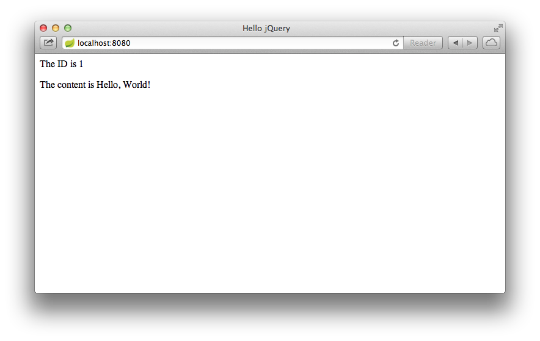

# 使用jQuery消费RESTful Web服务

> 原文：[Consuming a RESTful Web Service with jQuery](https://spring.io/guides/gs/consuming-rest-jquery/)
>
> 译者：william-hyx
>
> 校对：

本文将引导你开发一个简单的jQuery客户端，它可以消费基于Spring MVC的[RESTful web服务](https://spring.io/understanding/REST)。

##  你将构建什么

你将构建一个jQuery客户端用于消费基于Spring的RESTful web服务。特别地，该客户端将消费根据[Building a RESTful Web Service with CORS](https://spring.io/guides/gs/rest-service-cors/)创建的web服务。

在你的浏览器中打开```index.html```文件即可访问此jQuery客户端，同时通过接收下面的请求来消费该Web服务：

```http://rest-service.guides.spring.io/greeting```

该服务将返回一个[JSON](https://spring.io/understanding/JSON)格式的问候：

``` json
{"id":1, "content":"Hello, World!"}
```

jQuery客户端会将ID和content渲染到DOM中。

## 你需要什么

* 大约15分钟时间
* 一个喜欢的编辑器
* 一个现代web浏览器
* 可以访问到互联网

##  创建一个jQuery Controller

首先，你需要创建一个用于调用REST服务的jQuery controller模块：

```public/hello.js```

``` javascript
$(document).ready(function() {
    $.ajax({
        url: "http://rest-service.guides.spring.io/greeting"
    }).then(function(data) {
       $('.greeting-id').append(data.id);
       $('.greeting-content').append(data.content);
    });
});
```

该controller模块可看作一个简单的JavaScript函数。它使用jQuery的```$.ajax()``` 方法去调用位于[http://rest-service.guides.spring.io/greeting](http://rest-service.guides.spring.io/greeting)的REST服务。若调用成功，它将接收到的JSON数据赋值给```data``` 变量，实际上，是将其转化成```Greeting``` 对象。```id``` 和 ```content``` 字段分别添加到```greeting-id``` 和 ```greeting-content``` DOM元素上。

注意jQuery promise ```.then()``` 的使用。它告诉jQuery当```.$.ajax()``` 方法执行完成后，执行从完成的AJAX请求中传递```data``` 结果的异步函数。

## 创建应用页面

现在你拥有了jQuery controller，接下来需要创建加载客户端到用户web浏览器的HTML页面：

```public/index.html```

``` html
<!DOCTYPE html>
<html>
    <head>
        <title>Hello jQuery</title>
        <script src="https://ajax.googleapis.com/ajax/libs/jquery/1.10.2/jquery.min.js"></script>
        <script src="hello.js"></script>
    </head>

    <body>
        <div>
            <p class="greeting-id">The ID is </p>
            <p class="greeting-content">The content is </p>
        </div>
    </body>
</html>
```

注意```<head>``` 中下列两个脚本标签。

```
<script src="https://ajax.googleapis.com/ajax/libs/jquery/1.10.2/jquery.min.js"></script>
<script src="hello.js"></script>
```

第一个标签从内容分发网络(CDN)中加载压缩后的jQuery库(jquery.min.js)，这样你就不需要下载jQuery到项目中。第二个标签从应用路径中加载controller代码(hello.js)。

同时需要注意```<p>``` 标签中包含的```class``` 属性。

```html
<p class="greeting-id">The ID is </p>
<p class="greeting-content">The content is </p>
```

这些```class``` 属性帮助jQuery引用HTML元素，根据REST服务返回的JSON中的```id``` 和```content``` 字段值更新文本内容。

## 运行客户端

为了运行客户端，你需要web服务器托管该程序。Spring Boot CLI(Command Line Interface)包含一个内置的Tomcat服务器，它提供了一种简单的方式运行web内容。参见[Building an Application with Spring Boot](https://spring.io/guides/gs/spring-boot/)获取更多关于安装和使用CLI的信息。

为了使用Spring Boot中内置的Tomcat服务器托管静态内容，你还需要编写少量web应用代码以便让Spring Boot知道启动Tomcat。下面```app.groovy``` 脚本可以有效的启动Spring Boot中的Tomcat:

``` app.groovy```

```groovy
@Controller class JsApp {}
```

你现在可以使用Spring Boot CLI运行该app:

``` spring run app.groovy ```

当该app启动后，在你的浏览器中打开[http://localhost:8080](http://localhost:8080)，你将看到如下内容：



每次你刷新此页面时ID值都会自动增加。

## 总结

恭喜！你已开发了一个消费基于Spring的RESTful web服务的jQuery客户端。

## 其他参考资料

以下指南或许会有帮助：

* [Building a RESTful Web Service](https://spring.io/guides/gs/rest-service/)
* [Consuming a RESTful Web Service](https://spring.io/guides/gs/consuming-rest/)
* [Consuming a RESTful Web Service with AngularJS](https://spring.io/guides/gs/consuming-rest-angularjs/)
* [Consuming a RESTful Web Service with rest.js](https://spring.io/guides/gs/consuming-rest-restjs/)
* [Accessing GemFire Data with REST](https://spring.io/guides/gs/accessing-gemfire-data-rest/)
* [Accessing MongoDB Data with REST](https://spring.io/guides/gs/accessing-mongodb-data-rest/)
* [Accessing data with MySQL](https://spring.io/guides/gs/accessing-data-mysql/)
* [ccessing JPA Data with REST](https://spring.io/guides/gs/accessing-data-rest/)
* [Accessing Neo4j Data with REST](https://spring.io/guides/gs/accessing-neo4j-data-rest/)
* [Securing a Web Application](https://spring.io/guides/gs/securing-web/)
* [Building an Application with Spring Boot](https://spring.io/guides/gs/spring-boot/)
* [Creating API Documentation with Restdocs](https://spring.io/guides/gs/testing-restdocs/)
* [Enabling Cross Origin Requests for a RESTful Web Service](https://spring.io/guides/gs/rest-service-cors/)
* [Building a Hypermedia-Driven RESTful Web Service](https://spring.io/guides/gs/rest-hateoas/)

> [`本文`](http://rest-service.guides.spring.io/greeting)由spring4all.com翻译小分队创作，采用[知识共享-署名-非商业性使用-相同方式共享 4.0 国际 许可](http://creativecommons.org/licenses/by-nc-sa/4.0/) 协议进行许可。


