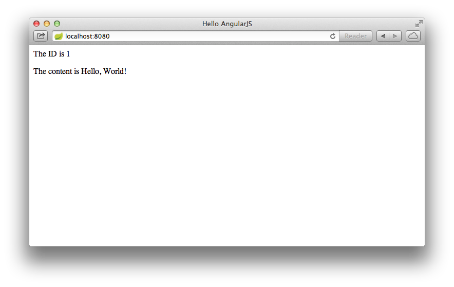

# 使用AngularJS消费RESTful Web服务

> 原文：[Consuming a RESTful Web Service with AngularJS](https://spring.io/guides/gs/consuming-rest-angularjs/)
>
> 译者：[郑云龙](https://github.com/yunlzheng)
>
> 校对：[happyxiaofan](https://github.com/happyxiaofan/)

本指南会引导你编写一个简单的AngularJS客户端来使用基于Spring MVC的[RESTful web service](https://spring.io/understanding/REST))。

## 你将要构建什么

你会构建一个AngularJS的客户端用于消费基于Spring的RESTful服务。 特别注意一点，这个服务项目是在[构建支持CORS的RESTful服务](https://spring.io/guides/gs/rest-service-cors/)指南中创建的。

AngularJS的客户端可以通过在浏览器中打开**index.html**来访问，并且会想以下地址发起请求：

```
http://rest-service.guides.spring.io/greeting
```

服务端会对gretting响应JSON格式的数据，如下：

```json
{"id":1,"content":"Hello, World!"}
```

AngularJS客户端会将ID以及content渲染到DOM当中

> 在rest-service.guides.spring.io中运行服务的代码主要来自[CORS指南](https://spring.io/guides/gs/rest-service-cors/)中的时候，不过做了一些小的改动: 在**@CrossOrigin**注解当中并没有定于domain相关的参数，因此这里对外完全开放了**/greeting**地址。

## 你需要什么

* 大概15分钟左右的时间
* 一个喜欢的编辑器
* 一个现代浏览器
* 可以访问到互联网

## 创建 AngularJS Controller

你首先需要创建一个AngularJS controller的模块，这个模块将会调用REST服务：

**public/hello.js**

```javascript
angular.module('demo', [])
.controller('Hello', function($scope, $http) {
    $http.get('http://rest-service.guides.spring.io/greeting').
        then(function(response) {
            $scope.greeting = response.data;
        });
});
```

该controller模块相当于一个简单的JavaScript函数，其使用了AngularJS的**$scope**和**$http**组件。并且使用$http组件向REST服务“/greeting”发起调用。

当请求成功后，该模块会将服务返回的JSON数据分配给**$scope.greeting**,并且创建一个名为“greeting”的模型对象。通过设置模型对象，AngularJS可以将其与页面的DOM对象绑定，并且渲染展示给用户。

## 创建应用页面

现在你已经拥有了一个AngularJS controller，接下来你需要创建一个HTML页面，并且在浏览器中加载这个controller：

**public/index.html**

```html
<!doctype html>
<html ng-app="demo">
	<head>
		<title>Hello AngularJS</title>
		<script src="https://ajax.googleapis.com/ajax/libs/angularjs/1.4.3/angular.min.js"></script>
    	<script src="hello.js"></script>
	</head>

	<body>
		<div ng-controller="Hello">
			<p>The ID is {{greeting.id}}</p>
			<p>The content is {{greeting.content}}</p>
		</div>
	</body>
</html>
```

需要注意一下在head节点中的两个script标签。

```html
<script src="https://ajax.googleapis.com/ajax/libs/angularjs/1.4.3/angular.min.js"></script>
<script src="hello.js"></script>
```

第一个script标签会从CDN网络中加载压缩后的AngularJS库(**angular.min.js**)，所以这里你并不需要下载AngularJS到你的项目当中。 这部分也会从应用目录加载controller代码（**hello.js**）

AngularJS库允许在标砖的HTML标签中使用多个自定义属性。在index.html当中，使用了两个自定义的属性：

* 标签```<html>``` 中的ng-app属性指明出当前页面是一个AngularJS应用。
* 标签 ```<div>``` 中的 ng-controller 属性将其与Controller Hello模块关联。

这里还有两个```<p>```标签，当中使用了占位符(使用双大括号标示)

```html
<p>The ID is {{greeting.id}}</p>
<p>The content is {{greeting.content}}</p>
```

占位符将会引用成功调用REST服务后的gretting模型对象中的**id**和**content**属性。

## 运行客户端

为了运行客户端程序，你需要使用Web服务器托管这个程序，并且通过浏览器访问。Spring Boot CLI（命令行接口）包含了一个内置的Tomcat服务器，它提供了一个简单的方式来提供Web内容服务。更多关于安装和使用CLI工具的内容可以参考[使用Spring Boot构建应用](https://spring.io/guides/gs/spring-boot/) 

为了托管静态内容到Spring Boot内置的Tomcat服务器中，你需要编写一个最小化的web应用代码来高数Spring Boot需要启动Tomcat. 下面这段**app.groovy**脚本就可以告诉Tomcat需要运行Tomcat:

**app.groovy**

```groovy
@Controller class JsApp { }
```

这时，可以通过Spring Boot CLI运行应用程序。

```
spring run app.groovy
```

一旦应用成功启动，在浏览器中打开 http://localhost:8080，就可以看到以下内容：



每次刷新页面ID的值都会自动增加。

## 总结

恭喜！刚才你已经开发了一个AngularJS客户端程序并且成功消费了一个基于Spring的RESTful服务。

## 其它参考资料

以下指南也可能会有帮助：

* [构建RESTful服务](https://spring.io/guides/gs/rest-service/)
* [消费RESTful服务](https://spring.io/guides/gs/consuming-rest/)
* [使用jQuery消费RESTful服务](https://spring.io/guides/gs/consuming-rest-jquery/)
* [使用rest.js消费RESTful服务](https://spring.io/guides/gs/consuming-rest-restjs/)
* [使用REST访问GemFire数据](https://spring.io/guides/gs/accessing-gemfire-data-rest/)
* [使用REST访问MongoDB数据](https://spring.io/guides/gs/accessing-mongodb-data-rest/)
* [访问MySQL数据](https://spring.io/guides/gs/accessing-data-mysql/)
* [使用REST访问JPA数据](https://spring.io/guides/gs/accessing-data-rest/)
* [使用REST访问Neo4j数据](https://spring.io/guides/gs/accessing-neo4j-data-rest/)
* [构建安全的Web应用](https://spring.io/guides/gs/securing-web/)
* [使用Spring Boot构建应用](https://spring.io/guides/gs/spring-boot/)
* [使用Restdocs创建API文档](https://spring.io/guides/gs/testing-restdocs/)
* [对RESTful启用Cross Origin支持](https://spring.io/guides/gs/rest-service-cors/)
* [构建超媒体驱动的RESTful Web服务](https://spring.io/guides/gs/rest-hateoas/)

> 本文由spring4all.com翻译小分队创作，采用[知识共享-署名-非商业性使用-相同方式共享 4.0 国际 许可](http://creativecommons.org/licenses/by-nc-sa/4.0/)协议进行许可。

